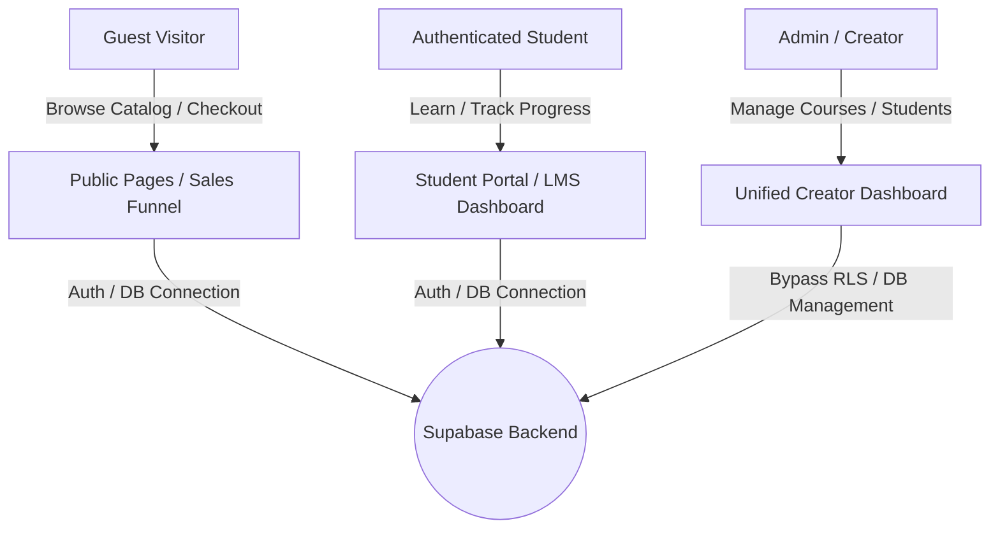

# Amplified Skills — Solo Creator E-Learning Platform
## Technical Specification & Implementation Plan (Version 2.0)

This document outlines the architecture, database schema, and development roadmap for the Amplified Skills platform. Since the platform operates on a single-instructor model, the Instructor and Admin dashboards are unified, and complex multi-instructor revenue sharing and review queues are omitted.

---

## 1. System Architecture & Simplified User Roles

### User Roles
- **Guest / Visitor**: Unauthenticated user browsing the public marketing pages, catalog, and checkout.
- **Student**: Authenticated user consuming purchased courses via the student portal.
- **Admin (You)**: The creator and sole administrator of the platform. Has full read/write access to courses, student lists, Q&A, and system settings.

### System Components


---

## 2. Complete & Correct Supabase SQL Schema
Run this SQL script in your **Supabase SQL Editor** to establish the complete database tables, RLS policies, custom claims trigger, and seed data.

```sql
-- ═══════════════════════════════════════════════════════════════════════════
-- 1. EXTENSIONS & FUNCTIONS
-- ═══════════════════════════════════════════════════════════════════════════
CREATE EXTENSION IF NOT EXISTS pgcrypto;

-- Ensure updated_at column exists on all tables that use the update trigger
-- (Included as migrations for existing tables)
ALTER TABLE profiles ADD COLUMN IF NOT EXISTS updated_at TIMESTAMPTZ DEFAULT NOW();
ALTER TABLE products ADD COLUMN IF NOT EXISTS updated_at TIMESTAMPTZ DEFAULT NOW();
ALTER TABLE courses ADD COLUMN IF NOT EXISTS updated_at TIMESTAMPTZ DEFAULT NOW();
ALTER TABLE modules ADD COLUMN IF NOT EXISTS updated_at TIMESTAMPTZ DEFAULT NOW();
ALTER TABLE lessons ADD COLUMN IF NOT EXISTS updated_at TIMESTAMPTZ DEFAULT NOW();
ALTER TABLE orders ADD COLUMN IF NOT EXISTS updated_at TIMESTAMPTZ DEFAULT NOW();
ALTER TABLE blog_posts ADD COLUMN IF NOT EXISTS updated_at TIMESTAMPTZ DEFAULT NOW();
ALTER TABLE notes ADD COLUMN IF NOT EXISTS updated_at TIMESTAMPTZ DEFAULT NOW();

-- ═══════════════════════════════════════════════════════════════════════════
-- 2. SCHEMAS & TABLES
-- ═══════════════════════════════════════════════════════════════════════════

-- PROFILES
CREATE TABLE IF NOT EXISTS profiles (
  id          UUID REFERENCES auth.users(id) ON DELETE CASCADE PRIMARY KEY,
  email       TEXT UNIQUE NOT NULL,
  full_name   TEXT,
  role        TEXT DEFAULT 'user', -- 'user' or 'admin'
  avatar_url  TEXT,
  bio         TEXT,
  has_access  BOOLEAN DEFAULT FALSE,
  created_at  TIMESTAMPTZ DEFAULT NOW(),
  updated_at  TIMESTAMPTZ DEFAULT NOW()
);

-- PRODUCTS (Main Store Items)
CREATE TABLE IF NOT EXISTS products (
  id            UUID DEFAULT gen_random_uuid() PRIMARY KEY,
  title         TEXT NOT NULL,
  slug          TEXT UNIQUE NOT NULL,
  description   TEXT,
  price         NUMERIC NOT NULL DEFAULT 0.00,
  compare_price NUMERIC,
  cover_image   TEXT,
  type          TEXT DEFAULT 'course', -- 'course' or 'ebook'
  is_published  BOOLEAN DEFAULT FALSE,
  created_at    TIMESTAMPTZ DEFAULT NOW(),
  updated_at    TIMESTAMPTZ DEFAULT NOW()
);

-- COURSES
CREATE TABLE IF NOT EXISTS courses (
  id               UUID REFERENCES products(id) ON DELETE CASCADE PRIMARY KEY,
  instructor       TEXT NOT NULL DEFAULT 'Admin',
  headline         TEXT,
  learning_outcomes TEXT[], -- What students will learn
  requirements     TEXT[],
  target_audience  TEXT[],
  created_at       TIMESTAMPTZ DEFAULT NOW(),
  updated_at       TIMESTAMPTZ DEFAULT NOW()
);

-- MODULES
CREATE TABLE IF NOT EXISTS modules (
  id          UUID DEFAULT gen_random_uuid() PRIMARY KEY,
  course_id   UUID REFERENCES courses(id) ON DELETE CASCADE NOT NULL,
  title       TEXT NOT NULL,
  order_index INTEGER NOT NULL DEFAULT 0,
  created_at  TIMESTAMPTZ DEFAULT NOW(),
  updated_at  TIMESTAMPTZ DEFAULT NOW()
);

-- LESSONS
CREATE TABLE IF NOT EXISTS lessons (
  id               UUID DEFAULT gen_random_uuid() PRIMARY KEY,
  module_id        UUID REFERENCES modules(id) ON DELETE CASCADE NOT NULL,
  title            TEXT NOT NULL,
  type             TEXT DEFAULT 'video', -- 'video', 'article', 'quiz'
  content          TEXT, -- markdown or rich text (for article type)
  video_url        TEXT, -- bunny.net, wistia, or youtube
  video_duration   INTEGER DEFAULT 0, -- in seconds
  order_index      INTEGER NOT NULL DEFAULT 0,
  is_free_preview  BOOLEAN DEFAULT FALSE,
  created_at       TIMESTAMPTZ DEFAULT NOW(),
  updated_at       TIMESTAMPTZ DEFAULT NOW()
);

-- ENROLLMENTS
CREATE TABLE IF NOT EXISTS enrollments (
  id          UUID DEFAULT gen_random_uuid() PRIMARY KEY,
  user_id     UUID REFERENCES profiles(id) ON DELETE CASCADE NOT NULL,
  course_id   UUID REFERENCES courses(id) ON DELETE CASCADE NOT NULL,
  progress    UUID[] DEFAULT '{}', -- list of completed lesson IDs
  enrolled_at TIMESTAMPTZ DEFAULT NOW(),
  UNIQUE(user_id, course_id)
);

-- ORDERS
CREATE TABLE IF NOT EXISTS orders (
  id               UUID DEFAULT gen_random_uuid() PRIMARY KEY,
  customer_email   TEXT NOT NULL,
  product_id       UUID REFERENCES products(id) ON DELETE SET NULL,
  amount           NUMERIC NOT NULL,
  currency         TEXT DEFAULT 'NGN',
  status           TEXT DEFAULT 'pending', -- 'pending', 'paid', 'failed'
  payment_reference TEXT UNIQUE,
  created_at       TIMESTAMPTZ DEFAULT NOW(),
  updated_at       TIMESTAMPTZ DEFAULT NOW()
);

-- BLOG POSTS
CREATE TABLE IF NOT EXISTS blog_posts (
  id           UUID DEFAULT gen_random_uuid() PRIMARY KEY,
  title        TEXT NOT NULL,
  slug         TEXT UNIQUE NOT NULL,
  summary      TEXT,
  content      TEXT NOT NULL,
  cover_image  TEXT,
  is_published BOOLEAN DEFAULT FALSE,
  created_at   TIMESTAMPTZ DEFAULT NOW(),
  updated_at   TIMESTAMPTZ DEFAULT NOW()
);

-- NOTES
CREATE TABLE IF NOT EXISTS notes (
  id          UUID DEFAULT gen_random_uuid() PRIMARY KEY,
  user_id     UUID REFERENCES profiles(id) ON DELETE CASCADE NOT NULL,
  lesson_id   UUID REFERENCES lessons(id) ON DELETE CASCADE NOT NULL,
  content     TEXT NOT NULL,
  timestamp   INTEGER DEFAULT 0, -- video timestamp in seconds (optional)
  created_at  TIMESTAMPTZ DEFAULT NOW(),
  updated_at  TIMESTAMPTZ DEFAULT NOW()
);

-- CATEGORIES
CREATE TABLE IF NOT EXISTS categories (
  id          UUID DEFAULT gen_random_uuid() PRIMARY KEY,
  name        TEXT NOT NULL UNIQUE,
  slug        TEXT NOT NULL UNIQUE,
  icon        TEXT
);

-- ═══════════════════════════════════════════════════════════════════════════
-- 3. AUTOMATED DB TRIGGERS
-- ═══════════════════════════════════════════════════════════════════════════

-- Auto-update updated_at timestamp function
CREATE OR REPLACE FUNCTION update_updated_at()
RETURNS TRIGGER AS $$
BEGIN NEW.updated_at = NOW(); RETURN NEW; END;
$$ LANGUAGE plpgsql;

-- Apply update trigger to tables
DO $$ DECLARE tbl TEXT; BEGIN
  FOREACH tbl IN ARRAY ARRAY['profiles','products','courses','modules','lessons','orders','blog_posts','notes'] LOOP
    EXECUTE format('DROP TRIGGER IF EXISTS %I_updated_at ON %I', tbl, tbl);
    EXECUTE format('CREATE TRIGGER %I_updated_at BEFORE UPDATE ON %I FOR EACH ROW EXECUTE FUNCTION update_updated_at()', tbl, tbl);
  END LOOP;
END $$;

-- Auto-create profile on signup trigger
CREATE OR REPLACE FUNCTION handle_new_user() RETURNS TRIGGER AS $$
BEGIN
  INSERT INTO public.profiles (id, email, full_name, role)
  VALUES (NEW.id, NEW.email, NEW.raw_user_meta_data->>'full_name', 'user')
  ON CONFLICT (id) DO NOTHING;
  RETURN NEW;
END;
$$ LANGUAGE plpgsql SECURITY DEFINER;

DROP TRIGGER IF EXISTS on_auth_user_created ON auth.users;
CREATE TRIGGER on_auth_user_created
  AFTER INSERT ON auth.users
  FOR EACH ROW EXECUTE FUNCTION handle_new_user();

-- Sync profile role to auth.users app_metadata (avoids recursive DB policy checks)
CREATE OR REPLACE FUNCTION sync_profile_role_to_auth()
RETURNS TRIGGER AS $$
BEGIN
  UPDATE auth.users
  SET raw_app_meta_data = 
    coalesce(raw_app_meta_data, '{}'::jsonb) || 
    jsonb_build_object('role', NEW.role)
  WHERE id = NEW.id;
  RETURN NEW;
END;
$$ LANGUAGE plpgsql SECURITY DEFINER;

DROP TRIGGER IF EXISTS trigger_sync_profile_role ON public.profiles;
CREATE TRIGGER trigger_sync_profile_role
  AFTER INSERT OR UPDATE OF role ON public.profiles
  FOR EACH ROW EXECUTE FUNCTION sync_profile_role_to_auth();

-- Auto-enroll students when order status is marked as 'paid'
CREATE OR REPLACE FUNCTION grant_enrollment_on_order() RETURNS TRIGGER AS $$
DECLARE v_user_id UUID; v_type TEXT;
BEGIN
  IF NEW.status = 'paid' AND NEW.product_id IS NOT NULL THEN
    SELECT type INTO v_type FROM products WHERE id = NEW.product_id;
    IF v_type = 'course' THEN
      SELECT id INTO v_user_id FROM profiles WHERE email = NEW.customer_email LIMIT 1;
      IF v_user_id IS NOT NULL THEN
        INSERT INTO enrollments (user_id, course_id)
        VALUES (v_user_id, NEW.product_id)
        ON CONFLICT DO NOTHING;
      END IF;
    END IF;
  END IF;
  RETURN NEW;
END;
$$ LANGUAGE plpgsql SECURITY DEFINER;

DROP TRIGGER IF EXISTS trigger_grant_enrollment ON orders;
CREATE TRIGGER trigger_grant_enrollment
  AFTER INSERT OR UPDATE ON orders
  FOR EACH ROW EXECUTE FUNCTION grant_enrollment_on_order();

-- ═══════════════════════════════════════════════════════════════════════════
-- 4. ROW LEVEL SECURITY (RLS) POLICIES
-- ═══════════════════════════════════════════════════════════════════════════

-- Enable RLS on all tables
ALTER TABLE profiles     ENABLE ROW LEVEL SECURITY;
ALTER TABLE products     ENABLE ROW LEVEL SECURITY;
ALTER TABLE courses      ENABLE ROW LEVEL SECURITY;
ALTER TABLE modules      ENABLE ROW LEVEL SECURITY;
ALTER TABLE lessons      ENABLE ROW LEVEL SECURITY;
ALTER TABLE enrollments  ENABLE ROW LEVEL SECURITY;
ALTER TABLE orders       ENABLE ROW LEVEL SECURITY;
ALTER TABLE blog_posts   ENABLE ROW LEVEL SECURITY;
ALTER TABLE notes        ENABLE ROW LEVEL SECURITY;
ALTER TABLE categories   ENABLE ROW LEVEL SECURITY;

-- Clean up any duplicate or orphaned policies
DO $$ 
DECLARE 
  tbl TEXT;
  pol RECORD;
BEGIN
  FOREACH tbl IN ARRAY ARRAY[
    'profiles', 'products', 'courses', 'modules', 'lessons', 
    'enrollments', 'orders', 'blog_posts', 'notes', 'categories'
  ] LOOP
    FOR pol IN 
      SELECT policyname 
      FROM pg_policies 
      WHERE tablename = tbl AND schemaname = 'public'
    LOOP
      EXECUTE format('DROP POLICY IF EXISTS %I ON %I', pol.policyname, tbl);
    END LOOP;
  END LOOP;
END $$;

-- Helper: checks if requester is admin via JWT claims directly (reventing recursion)
CREATE OR REPLACE FUNCTION is_admin() RETURNS BOOLEAN AS $$
  SELECT coalesce(
    nullif(current_setting('request.jwt.claims', true), '')::jsonb -> 'app_metadata' ->> 'role',
    ''
  ) = 'admin';
$$ LANGUAGE sql SECURITY DEFINER STABLE;

-- Profiles Policies
CREATE POLICY "profiles_self_read"   ON profiles FOR SELECT USING (auth.uid() = id OR is_admin());
CREATE POLICY "profiles_self_update" ON profiles FOR UPDATE USING (auth.uid() = id);
CREATE POLICY "profiles_admin_all"   ON profiles FOR ALL    USING (is_admin());

-- Products Policies
CREATE POLICY "products_public_read" ON products FOR SELECT USING (is_published = true OR is_admin());
CREATE POLICY "products_admin_all"   ON products FOR ALL    USING (is_admin());

-- Courses Policies
CREATE POLICY "courses_public_read"  ON courses FOR SELECT USING (true);
CREATE POLICY "courses_admin_all"    ON courses FOR ALL    USING (is_admin());

-- Modules Policies
CREATE POLICY "modules_public_read"  ON modules FOR SELECT USING (true);
CREATE POLICY "modules_admin_all"    ON modules FOR ALL    USING (is_admin());

-- Lessons Policies
CREATE POLICY "lessons_public_read"  ON lessons FOR SELECT USING (
  is_free_preview = true OR is_admin() OR EXISTS (
    SELECT 1 FROM enrollments e
    JOIN modules m ON m.id = lessons.module_id
    WHERE e.user_id = auth.uid() AND e.course_id = m.course_id
  )
);
CREATE POLICY "lessons_admin_all"    ON lessons FOR ALL    USING (is_admin());

-- Enrollments Policies
CREATE POLICY "enrollments_self"     ON enrollments FOR ALL USING (user_id = auth.uid() OR is_admin());

-- Orders Policies
CREATE POLICY "orders_self"          ON orders FOR SELECT USING (customer_email = (SELECT email FROM profiles WHERE id = auth.uid()) OR is_admin());
CREATE POLICY "orders_insert"        ON orders FOR INSERT WITH CHECK (true);
CREATE POLICY "orders_admin_all"     ON orders FOR ALL    USING (is_admin());

-- Blog Posts Policies
CREATE POLICY "blog_public_read"     ON blog_posts FOR SELECT USING (is_published = true OR is_admin());
CREATE POLICY "blog_admin_all"       ON blog_posts FOR ALL    USING (is_admin());

-- Notes Policies
CREATE POLICY "notes_self"           ON notes FOR ALL USING (user_id = auth.uid() OR is_admin());

-- Categories Policies
CREATE POLICY "categories_public_read" ON categories FOR SELECT USING (true);
CREATE POLICY "categories_admin_all"   ON categories FOR ALL    USING (is_admin());

-- ═══════════════════════════════════════════════════════════════════════════
-- 5. SEED DATA & ADMIN REGISTRATION
-- ═══════════════════════════════════════════════════════════════════════════
DO $$
DECLARE
  admin_id UUID := 'd0d93708-3cb7-4d7a-8fcd-1a89c8a98b47';
BEGIN
  -- 1. Insert into auth.users if not exists
  IF NOT EXISTS (SELECT 1 FROM auth.users WHERE email = 'admin@amplifiedskills.com') THEN
    INSERT INTO auth.users (
      instance_id,
      id,
      aud,
      role,
      email,
      encrypted_password,
      email_confirmed_at,
      recovery_sent_at,
      last_sign_in_at,
      raw_app_meta_data,
      raw_user_meta_data,
      created_at,
      updated_at,
      confirmation_token,
      email_change,
      email_change_token_new,
      recovery_token
    ) VALUES (
      '00000000-0000-0000-0000-000000000000',
      admin_id,
      'authenticated',
      'authenticated',
      'admin@amplifiedskills.com',
      extensions.crypt('Test123456', extensions.gen_salt('bf', 10)),
      now(),
      now(),
      now(),
      '{"provider": "email", "providers": ["email"]}',
      '{"full_name": "Admin User"}',
      now(),
      now(),
      '',
      '',
      '',
      ''
    );
  ELSE
    SELECT id INTO admin_id FROM auth.users WHERE email = 'admin@amplifiedskills.com';
  END IF;

  -- 2. Insert into auth.identities if not exists
  IF NOT EXISTS (SELECT 1 FROM auth.identities WHERE user_id = admin_id) THEN
    INSERT INTO auth.identities (
      id,
      provider_id,
      user_id,
      identity_data,
      provider,
      last_sign_in_at,
      created_at,
      updated_at
    ) VALUES (
      admin_id,
      admin_id::text,
      admin_id,
      format('{"sub":"%s","email":"%s"}', admin_id::text, 'admin@amplifiedskills.com')::jsonb,
      'email',
      now(),
      now(),
      now()
    );
  END IF;

  -- 3. Ensure public.profiles has admin role
  INSERT INTO public.profiles (id, email, full_name, role)
  VALUES (admin_id, 'admin@amplifiedskills.com', 'Admin User', 'admin')
  ON CONFLICT (id) DO UPDATE SET role = 'admin';

  UPDATE public.profiles SET role = 'admin' WHERE email = 'admin@amplifiedskills.com';

END $$;

-- Force sync existing user roles to auth app_metadata
UPDATE public.profiles SET role = role;
```

---

## 3. Phased Roadmap (Frontend React & Supabase API)

### Phase 1 — MVP Completion (Launch Checklist)
1. **Security & Guarding routes**: 
   Ensure `AdminDashboard.jsx` handles authentication loading cleanly and redirects non-admins.
2. **Registration Page (`RegisterPage.jsx`)**:
   Implement standard sign-up utilizing email verification toggles, rendering immediate verification notification flags or directing to `/dashboard` based on settings.
3. **Automatic Admin Redirects**:
   - `LoginPage.jsx` redirects authenticated admins directly to `/admin` and students to `/dashboard`.
   - `LMSDashboard.jsx` protects itself by redirecting admins to `/admin`.
4. **Course Catalog & Detail Pages**:
   Fetch courses dynamically from `public.products` (where `type = 'course'` and `is_published = true`).

### Phase 2 — System Enhancements (Monetization & Engagement)
1. **Coupon / Discount Module**:
   Implement coupon parameters verification during Paystack transaction init.
2. **Dynamic Quizzes**:
   Build database nodes for questions and configure quiz render blocks inside the `CoursePlayer` navigator.
3. **Automated Completion Certificates**:
   Establish threshold calculation triggers that generate downloadable certificates (PDF) containing the student's name, completion date, and platform seal.

---

## 4. Key Integrations & Settings
- **Payments (Paystack)**: Hook transaction initialization with backend checkout processing. Upon payment verification, query Paystack API `GET /transaction/verify/:reference`. On success, insert order status as `'paid'`, which automatically fires `trigger_grant_enrollment` in Supabase to grant the student course access.
- **Video CDN (Wistia)**: Retrieve dynamic URLs from the lessons module table and inject them directly into the Custom Player layout.
- **Client Supabase Connection**: Ensure VITE environment keys utilize correct credentials, securely persisting session tokens in `localStorage`.
